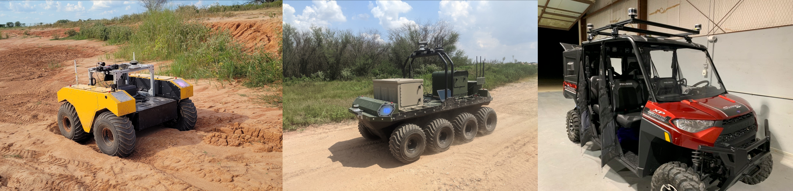

# G-VOM
## A GPU Accelerated Voxel Off-Road Mapping System 

A Python 3 ROS package for lidar based off-road mapping.

##  Overview

G-VOM is a local 3D voxel mapping framework for off-road path planning and navigation. It provides both hard and soft positive obstacle detection, negative obstacle detection, slope estimation, and roughness estimation. By using a 3D array lookup table data structure and by leveraging the GPU it can provide online performance.

## Results

We implemented G-VOM on three vehicles that were tested at the Texas A&M RELLIS campus. A Clearpath Robotics [Warthog](https://clearpathrobotics.com/warthog-unmanned-ground-vehicle-robot/) and [Moose](https://clearpathrobotics.com/moose-ugv/), and a [Polaris Ranger](https://ranger.polaris.com/en-us/). For sensing we used an Ouster OS1-64 lidar on the Warthog and an Ouster OS1-128 lidar on the Moose and Ranger.
For all vehicles, the system was ran on a laptop with an Nvidia Quadro RTX 4000 GPU and an Intel i9-10885H CPU achieving a mapping rate from 9-12 Hz.

The video below shows autonomous operation on the Warthog at 4 m/s.

For more detailed results see the paper.

##  Prerequisites
### **Ubuntu** 
Ubuntu 64-bit 20.04.

### **Python**
[Python 3.6](https://www.python.org/downloads/) or later.

### **Numba CUDA**
Follow [Numba Installation](https://numba.pydata.org/numba-doc/latest/user/installing.html) and [Numba CUDA](https://numba.pydata.org/numba-doc/latest/cuda/overview.html#setting-cuda-installation-path).

### **ROS**
ROS Noetic. [ROS Installation](http://wiki.ros.org/ROS/Installation)
Note, ROS is only needed to run gvom_ros.py.

## Usage

The system is implemented within a class in gvom.py. There are three public functions. Class initialization,  process_pointcloud, and combine_maps. 

Class initialization initialises all parameters for the class. A description of each parameter is provided in the file.

process_pointcloud takes the pointcloud, ego position, and optionally a transform matrix. It Imports a pointcloud and processes it into a voxel map then adds the map to the buffer. The transform matrix is necessary if the pointcloud is not in the world frame since all map processing is in the world frame..
 
combine_maps takes no inputs and processes all maps in the buffer into a set of 2D output maps. The outputs are the map origin, positive obstacle map, negative obstacle map, roughness map, and visibility map.

Note process_pointcloud and combine_maps can be ran asynchronously. Multiple sensors can each call process_pointcloud however we recommend a buffer size greater than twice the number of sensors.

### ROS Example
An example ROS implementation is provided in gvom_ros.py. It subscribes to a PointCloud2 message and an Odometry message. Additionally, it requires a tf tree between the “odom_frame” and the PointCloud2 message’s frame. It’s assumed that the Odometry message is in the “odom_frame”.

## Cite Us
~~~text
@misc{Overbye2021GVOM,
      title={G-VOM: A GPU Accelerated Voxel Off-Road Mapping System}, 
      author={Timothy Overbye and Srikanth Saripalli},      
      year={2021},          
}
~~~

